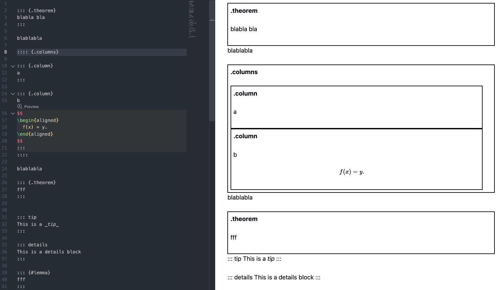

Adds [markdown-it-container](https://github.com/markdown-it/markdown-it-container) support to VS Code.

This is a customized version of [markdown-it-container](https://github.com/yzhang-gh/vscode-markdown-container).

We have removed the `tip` and `details` block containers, but retained all other block containers using the `{container-name}` syntax. Each block container simply wraps the content inside with a border and a title.

### More

[Vuepress Custom Containers](https://vuepress.vuejs.org/guide/markdown.html#custom-containers)
